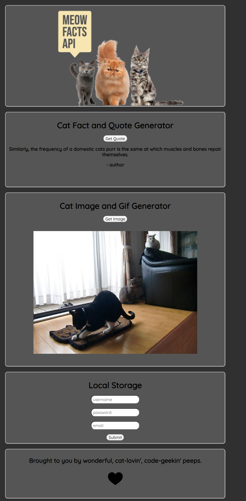
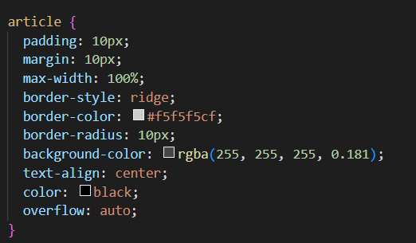
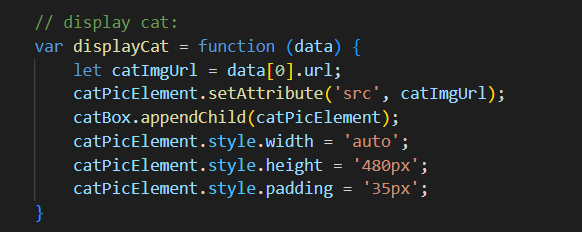

# MeowFacts

# Table of Contents
1. About the Project
* User Story
* Built with
2. Getting Started
* Prerequisites
* Installation
3. Usage
4. Roadmap
5. Contributing
6. License
7. Contact
8. Acknowlegments

# About the Project

User Story:
* AS a user in need of a break from stress
* I WANT a simple app that shows pictures of cute cats and facts about felines
* So THAT I can be relieved of stress
*Given the need for information and animal pictures

[Back to Top](#MeowFacts)

# Built with

* HTML
* CSS
* JAVASCRIPT
* JQUERY
* BULMA
* MaterializeCSS
* Googlefonts

[Back to Top](#MeowFacts)

# Getting Started

## Instructions to set up this repo locally. Follow the below steps.

###### Prerequisites

* github
* VS Code or other code editor

###### Installation

1. Get a free API Key at []
2. Clone the repo
3. Install code editor
4. Enter the API in the code editor

[Back to Top](#MeowFacts)

# Usage

If random facts and quotes about cats tickles your toebeans this app is for you! If you enjoy looking at random cat pictures and gifs then this app is also for you! 

Screenshots:

Demo:
 

[Back to Top](#MeowFacts)

# Roadmap

- [ ] Add Demo
- [x] Add Back to Top links
- [x] Add Examples
- [x] Add Links

## Please see open issues list for any proposed features, known and unkown issues.

[Back to Top](#MeowFacts)

# Contributing

## Contributions are the open source community's asset and are valued for creativity, inspiration and continued learning. Contributions are greatly appreciated.
Suggestions are welcome via forking the repo and pull requests. Please open and tag the issue with 'betterment'. Please give the project a star. Thank you again for all contributions.
1. Fork the Project
2. Commit your Changes
4. Push to the Branch
5. Open a Pull Request

[Back to Top](#MeowFacts)

# License

###### Distributed under the MIT License. See [LICENSE.txt] for more information.

[Back to Top](#MeowFacts)

# Contact

- [Luke](https://github.com/BarkMulcher) 
- [Jackie](https://github.com/heatleyj7)
- [Felicia](https://github.com/maddiethornberry) 

[Back to Top](#MeowFacts)

# Acknowledgments

## Resources our group found useful
* [github](https://github.com/)
* [W3schools](https://w3schools.com/)
* [CSS-Tricks](https://css-tricks.com/)
* [itnext](https://itnext.io/)
* [stackoverflow](https://stackoverflow.com/)

[Back to Top](#MeowFacts)

# Releases

[View deployed site](https://heatleyj7.github.io/cat-api-project/)

[Back to Top](#MeowFacts)

# Packages

###### No packages published

[Back to Top](#MeowFacts)

# Contributors

- [Luke](https://github.com/BarkMulcher) 
- [Jackie](https://github.com/heatleyj7)
- [Felicia](https://github.com/maddiethornberry) 

[Back to Top](#MeowFacts)

